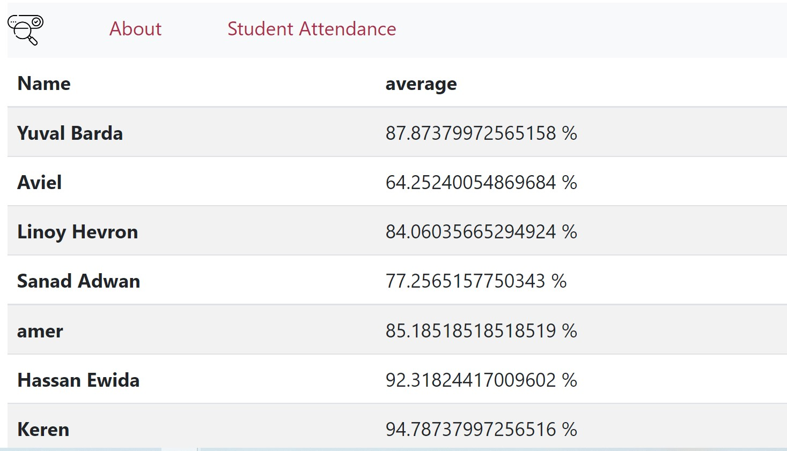

# Attendance calculation 

## This is a flask app, that calculates the overall attendance percentage in class.

# Build with:

* ![Flask][flask.dev]
* ![Mysql][mysql.dev]
* ![bootstrap][bootstrap.js]


> First you will need to clone this repo

> Second create a .env file inside doccker-compose directory, and add the following 
``` 
DB_HOST=${DB_HOST}
DB_UNAME=${DB_UNAME}
DB_PASSWORD=${DB_PASSWORD}
DB_PORT=${DB_PORT}
REMOTE_IP=${REMOTE_IP}
REMOT_PASS=${REMOT_PASS}
REMOT_UNAME=${REMOT_UNAME}
```
> Run ``docker compose up``

## Screen shot example



[mysql.dev]: https://img.shields.io/badge/Mysql-DD0031?style=for-the-badge&logo=mysql&logoColor=white
[bootstrap.js]: https://img.shields.io/badge/bootstrap-795da3?style=for-the-badge&logo=bootstrap&logoColor=white
[flask.dev]: https://img.shields.io/badge/Flask-563D7C?style=for-the-badge&logo=flask&logoColor=white
