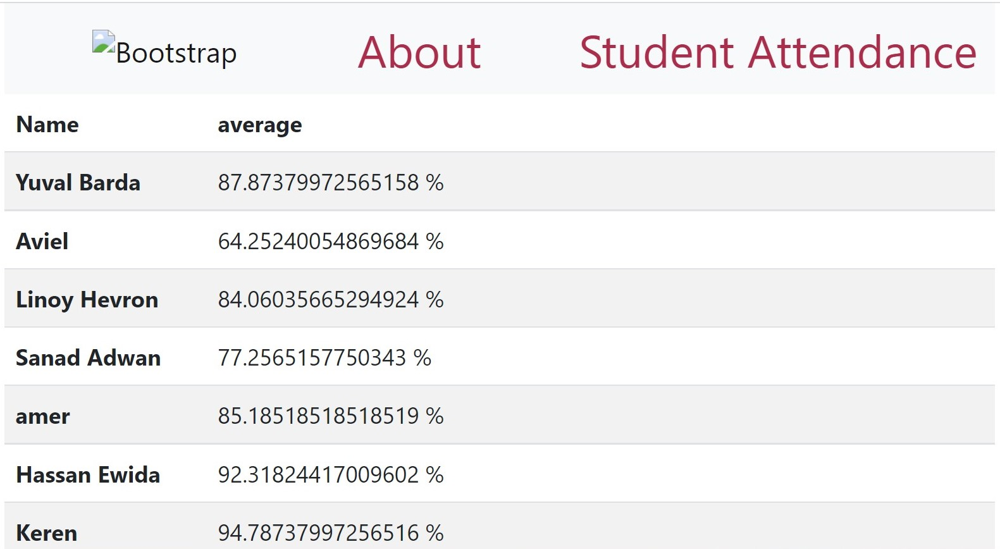

# Attendance caculation 

## This is a flask app, that caculates the overall attendance percentage in class.

> First you will need to clone this repo

> Second create a .env file, and add the following 
``` 
DB_HOST=${DB_HOST}
DB_UNAME=${DB_UNAME}
DB_PASSWORD=${DB_PASSWORD}
DB_PORT=${DB_PORT}
REMOTE_IP=${REMOTE_IP}
REMOT_PASS=${REMOT_PASS}
REMOT_UNAME=${REMOT_UNAME}
```
> Run ``docker compose up``

## screen shot example

